**************************************************************
HOW TO INSTALL AND CONFIGURE THE ETOKEN & THE MYPROXY SERVLETS 
**************************************************************

===================
About this document
===================

.. _1: http://www.safenet-inc.it/etoken-pro.html
.. _2: http://www.catania-science-gateways.it/
.. _3: http://www.safenet-inc.it/

This is the official documentation to configure and install the eTokenServer servlet (v2.0.4).

This document provides an in-depth overview of the light-weight crypto library, a standard-based solution developed by INFN Catania for central management of robot credentials and provisioning of digital proxies to get seamless and secure access to computing e-Infrastructures supporting the X.509 standard for Authorisation.

In this solution robot certificates are available 24h per day on board of USB eToken PRO [1_] 32/64 KBytes smart cards having the following technical specification:

We appreciate attribution. In case you would like to cite the Java light-weight crypto library in your papers, we recomment that you use the following reference:

        V. Ardizzone, R. Barbera, A. Calanducci, M. Fargetta, E. Ingra', I. Porro, 
        G. La Rocca, S. Monforte, R. Ricceri, R. Rotondo, D. Scardaci and A. Schenone
        ***The DECIDE Science Gateway***
        *Journal of Grid Computing (2012) 10:689-70 DOI 10.1007/s10723-012-9242-3*

We also would like to be notified about your publications that involve the use of the Java light-weight crypto libraries, as this will help us to document its usefulness. We like to feature links to these articles, with your permission, on our Web site.
Additional reference to the Java light-weight crypto library and other relevant activities can be fould at [2_].

Licence
-----------------
Licensed to the Apache Software Foundation (ASF) under one or more contributor license agreements.  See the NOTICE file distributed with this work for additional information regarding copyright ownership.
The ASF licenses this file to You under the Apache License, Version 2.0 (the "License"); you may not use this file except in compliance with the License.  You may obtain a copy of the License at http://www.apache.org/licenses/LICENSE-2.0

Unless required by applicable law or agreed to in writing, software distributed under the License is distributed on an "AS IS" BASIS, WITHOUT WARRANTIES OR CONDITIONS OF ANY KIND, either express or implied.
See the License for the specific language governing permissions and limitations under the License.

Conventions used in this document
-----------------
The following typographical conventions are used in this document:

*Italic*
        Indicates new terms, URLs, filenames, and file extentions

**Constant width italic**
        Shows text that should be replaced with user-specific values

|warning| This icon indicates a warning or caution.

|download| This icon indicates that there are files to be downloaded.

============
Chapter I - Overview of the light-weight crypto library
============
The "light-weight" crypto library interface has been designed to:

- provide seamless and secure access to computing e-Infrastructure based on middleware supporting X.509 standard for authorization, using robot certificates,

- make user's interaction with security infrastructures easy and transparent.

The high-level architecture of the library interface is shown in the below figure:

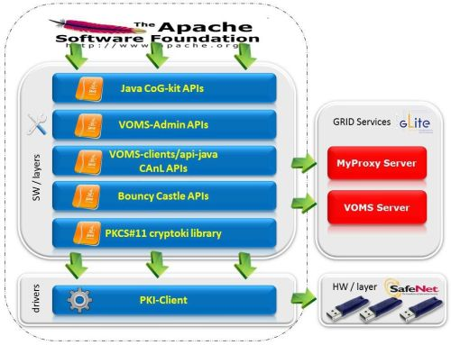

The business logic has been conceived to provide "resources" (e.g. complaint VOMS proxies) in a "web-manner" which can be consumed by authorized users, client applications and by portals and Science Gateways. In the current implementation, robot certificates have been safely installed on board of SafeNet [3_] eToken PRO [1_] 32/64 KBytes USB smart cards directly plugged to a remote server which serve, so far, six different Science Gateways.

.. _4: http://tomcat.apache.org/
.. _5: https://jax-rs-spec.java.net/
.. _6: http://www.oracle.com/technetwork/articles/javaee/index-jsp-136246.html
.. _7: http://docs.oracle.com/javase/7/docs/technotes/guides/security/p11guide.html
.. _8: https://www.bouncycastle.org/
.. _9: https://github.com/jglobus/JGlobus
.. _10: https://github.com/italiangrid/voms-clients
.. _11: https://github.com/italiangrid/voms-admin-server/tree/master/voms-admin-api

The complete list of software, tools and APIs we have used to implement the new crypto library interface are listed below:

- Apache Application Server [4_],

- JAX-RS, the Java API for RESTful Web Services (JSR 311 standard) [5_], 

- Java Technology Standard Edition (Java SE6) [6_],

- The Cryptographic Token Interface Standard (PKCS#11) libraries [7_],

- The open-source BouncyCastle Java APIs [8_],

- The JGlobus-Core Java APIs [9_],

- The VOMS-clients Java APIs [10_],

- The VOMS-Admin Java APIs [11_].

============
Chapter II - System and Software Requirements
============
This chapter provide the list of requirements and the basic information that you need to know to install and configure the servlet.

+---+-----------------------+-------------------------+--------------+------------+--------------+
| # |        Server         |       OS and Arch.      |  Host. Cert  | Disk Space | CPU and RAM  |
+===+=======================+=========================+==============+============+==============+
| 1 | Physical machine with | SL release 5.10 (Boron) |     Yes      |  >= 80 GB  |  >= 4 cores  |
|   | at least 2 USB ports  | x86_64 GNU/Linux        |              |            |  >= 8 GB RAM |
|   | perfectly working     |                         |              |            |  Swap >=4 GB |
+---+-----------------------+------------+------------+--------------+------------+--------------+
| Comments:                                                                                      |
|                                                                                                |
| - The server must be registered to the DNS with direct adn reverse resolution;                 |
|                                                                                                |
| - Please set a **human readable** server hostname for your server (e.g. etoken<your-domain>);  |
|                                                                                                |
| - The OS installation should include the X-server since it is needed to open etProps app;      |
|                                                                                                |
| - This installation has been successfully tested with eToken PRO 32/64 KBytes USB smart cards; |
|                                                                                                |
| - At least 1 USB eToken PRO 75 KBytes must be available before the installation                |
|   (contact SafeNet Inc. [3_] to find a neighbor reseller and get prices).                      |
+------------------------------------------------------------------------------------------------+

OS and repos
-----------------
Start with a fresh installation of Scientific Linux 5.X (x86_64).

.. code:: bash

  ]# cd /etc/redhat-release
  Scientific Linux release 5.10 (Boron)

- Configure the EGI Trust Anchor repository

.. code:: bash

  ]# cd /etc/yum.repos.d/
  ]# cat egi-trustanchors.repo
  [EGI-trustanchors]
  name=EGI-trustanchors
  baseurl=http://repository.egi.eu/sw/production/cas/1/current/
  gpgkey=http://repository.egi.eu/sw/production/cas/1/GPG-KEY-EUGridPMA-RPM-3
  gpgcheck=1
  enabled=1

- Install the latest EUGridPMA CA rpms

.. code:: bash

  ]# yum clean all
  ]# yum install -y ca-policy-egi-core

- Configure the EPEL repository:

.. code:: bash

  ]# cd /etc/yum.repos.d/
  ]# cat /etc/yum.repos.d/epel.repo 
  [epel]
  name=Extra Packages for Enterprise Linux 5 - $basearch
  #baseurl=http://download.fedoraproject.org/pub/epel/5/$basearch
  mirrorlist=http://mirrors.fedoraproject.org/mirrorlist?repo=epel-5&arch=$basearch
  failovermethod=priority
  enabled=1
  gpgcheck=1
  gpgkey=file:///etc/pki/rpm-gpg/RPM-GPG-KEY-EPEL

  [epel-debuginfo]
  name=Extra Packages for Enterprise Linux 5 - $basearch - Debug
  #baseurl=http://download.fedoraproject.org/pub/epel/5/$basearch/debug
  mirrorlist=http://mirrors.fedoraproject.org/mirrorlist?repo=epel-debug-5&arch=$basearch
  failovermethod=priority
  enabled=0
  gpgkey=file:///etc/pki/rpm-gpg/RPM-GPG-KEY-EPEL
  gpgcheck=1

  [epel-source]
  name=Extra Packages for Enterprise Linux 5 - $basearch - Source
  #baseurl=http://download.fedoraproject.org/pub/epel/5/SRPMS
  mirrorlist=http://mirrors.fedoraproject.org/mirrorlist?repo=epel-source-5&arch=$basearch
  failovermethod=priority
  enabled=0
  gpgkey=file:///etc/pki/rpm-gpg/RPM-GPG-KEY-EPEL
  gpgcheck=1

- Install the latest epel release

.. code:: bash

  ]# yum install -y epel-release-5.4.noarch

SELinux configuration
-----------------

.. _12: fedoraproject.org/wiki/SELinux/setenforce

Be sure that SELinux is disabled (or permissive). Details on how to disable SELinux are here [12_]

.. code:: bash

   ]# getenforce
   Disabled

sendmail
-----------------
Start the sendmail service at boot. 
Configure access rules to allow connections and open the firewall on port 25.

.. code:: bash

   ]# /etc/init.d/sendmail start
   ]# chkconfig --level 2345 sendmail on

   ]# cat /etc/hosts.allow
   sendmail: localhost

   ]# cat /etc/sysconfig/iptables
   [..]
   -A RH-Firewall-1-INPUT -p tcp -m tcp --dport 25 -s 127.0.0.1 -j ACCEPT

NTP
-----------------
Use NTP to synchronize the time of the server 

.. code:: bash

   ]# ntpdate ntp-1.infn.it
   ]# /etc/init.d/ntpd start
   ]# chkconfig --level 2345 ntpd on

fetch-crl
-----------------
Install and configure the fetch-crl

.. code:: bash

   ]# yum install -y fetch-crl
   ]# /etc/init.d/fetch-crl-cron start
   ]# chkconfig --level fetch-crl-cron on

Host Certificates
-----------------

.. _13: http://www.eugridpma.org/members/worldmap/
.. _14: https://comodosslstore.com/

Navigate the interactive map and search for your closest Certification Authorities [13_] or, alternatively, buy a multi-domain COMODO [14_] SSL certificate.

Public and Private keys of the host certificate have to be copied in /etc/grid-security/

.. code:: bash

   ]# ll /etc/grid-security/host*
   -rw-r--r--  1 root root 1627 Mar 10 14:55 /etc/grid-security/hostcert.pem
   -rw-------  1 root root 1680 Mar 10 14:55 /etc/grid-security/hostkey.pem

Configure VOMS Trust Anchors
-----------------
The VOMS-clients APIs need local configuration to validate the signature on Attribute Certificates issued by trusted VOMS servers.

The VOMS clients and APIs look for trust information in the */etc/grid-security/vomsdir* directory.

The *vomsdir* directory contains a directory for each trusted VO. Inside each VO two types of files can be found:

- An *LSC*  file contains a description of the certificate chain of the certificate used by a VOMS server to sign VOMS attributes.

- An *X509* certificates used by the VOMS server to sign attributes.

These files are commonly named using the following pattern:

.. code:: bash

   <hostname.lsc>
   <hostname.pem>

where *hostname* is the host where the VOMS server is running.

When both *.lsc* and *.pem* files are present for a given VO, the *.lsc* file takes precedence. 
The *.lsc* file contains a list of X.509 subject strings, one on each line, encoded in OpenSSL slash-separate syntax, describing the certificate chain (up and including the CA that issued the certificate). For instance, the *voms.cnaf.infn.it* VOMS server has the following *.lsc* file:

.. code:: bash
  
  /C=IT/O=INFN/OU=Host/L=CNAF/CN=voms.cnaf.infn.it
  /C=IT/O=INFN/CN=INFN CA

.. _15: others/vomsdir.tar.gz

|warning| Install in */etc/grid-security/vomsdir/* directory the *.lsc* for each trusted VO that you want to support.

|download| An example of */etc/grid-security/vomsdir/* directory can be downloaded from here [15_].

Configure VOMS server endpoints
-----------------
The list of known VOMS server is maintained in *vomses* files. A vomses file is a simple text file which contains one or more lines formatted as follows:

.. code:: bash

        "vo_name"       "hostname"      "port"  "dn"    "aliases"

Where:

- *vo_name* is the name of the VO served by the VOMS server, 

- *hostname* is the hostname where the VOMS server is running, 

- *port* is the port where the VOMS server is listening for incoming requests,

- *dn* is the subject of certificate of the VOMS server, and the

- *aliases* is an alias that can be used for this VOMS server (this is typically identical to the *vo_name*).

System wide VOMSES configuration is maintained in the */etc/vomses* file or directory. If the */etc/vomses/* is a directory, all the files contained in such directory are parsed looking fro VOMS contact information.

.. _16: others/vomses.tar.gz

|warning| Install in the */etc/vomses* the contact information for each trust VO you want to support!

|download| An example of VOMS contact information can be downloaded from [16_]

===================
Chapter III - Installation & Configuration
===================
This chapter introduces the manual installation of the SafeNet eToken PKI client library on a Linux system, the software that enables eToken USB operations and the implementation of eToken PKI-based solutions. 

Software Requirements
-----------------

The software also includes all the necessary files and drivers to support the eToken management. 
During the installation, the needed libraries and drivers will be installed in */usr/local/bin*, */usr/local/lib* and */usr/local/etc*.

|warning| Before to start, please check if pcsc- packages are already installed on your server. 

.. code:: bash

   ]# rpm -e pcsc-lite-1.4.4-4.el5_5 \
             pcsc-lite-libs-1.4.4-4.el5_5 \
             pcsc-lite-doc-1.4.4-4.el5_5 \
             pcsc-lite-devel-1.4.4-4.el5_5 \ 
             ccid-1.3.8-2.el5.i386 \
             ifd-egate-0.05-17.el5.i386 \
             coolkey-1.1.0-16.1.el5.i386 \
             esc-1.1.0-14.el5_9.1.i386

|download| Download the correct software packages:

.. _17: http://dag.wieers.com/rpm/packages/pcsc-lite/pcsc-lite-1.3.3-1.el4.rf.i386.rpm
.. _18: http://dag.wieers.com/rpm/packages/pcsc-lite/pcsc-lite-libs-1.3.3-1.el4.rf.i386.rpm
.. _19: http://dag.wieers.com/rpm/packages/pcsc-lite-ccid/pcsc-lite-ccid-1.2.0-1.el4.rf.i386.rpm

- pcsc-lite-1.3.3-1.el4.rf.i386.rpm [17_] 

- pcsc-lite-libs-1.3.3-1.el4.rf.i386.rpm [18_]

- pcsc-lite-ccid-1.2.0-1.el4.rf.i386.rpm [19_]

.. code:: bash

   ]# rpm -ivh pcsc-lite-1.3.3-1.el4.rf.i386.rpm \
               pcsc-lite-ccid-1.2.0-1.el4.rf.i386.rpm \ 
               pcsc-lite-libs-1.3.3-1.el4.rf.i386.rpm

        Preparing...            ########################################### [100%]
        1:pcsc-lite-libs        ########################################### [ 33%] 
        2:pcsc-lite-ccid        ########################################### [ 67%] 
        3:pcsc-lite             ########################################### [100%]

Before installing the eToken PKI Client, please check if the PC/SC-Lite pcscd daemon is running:

.. code:: bash

   ]# /etc/init.d/pcscd start

Install PKI_Client library
-----------------

|warning| Contact the SafeNet Inc. and install the latest eToken PKI Client (ver. 4.55-34) software on your system.

.. code:: bash

   ]$ rpm -ivh pkiclient-full-4.55-34.i386.rpm

   Preparing...             ########################################### [100%] 
   Stopping PC/SC smart card daemon (pcscd): [ OK ]
           1:pkiclient-full ########################################### [100%] 
   Checking installation of pcsc from source... None.
   Starting PC/SC smart card daemon (pcscd): [ OK ] 
   Adding eToken security provider...Done.
   PKIClient installation completed. 

.. _20: others/Mkproxy-rhel4.tar.gz
.. _21: others/eTokens-2.0.5.tar.gz

Configure additional libraries
-----------------

|download| Download the appropriate libraries [20_] for your system and save it as *Mkproxy-rhel4.tar.gz*. 

The archive contains all the requires libraries for RHEL4 and RHEL5.

.. code:: bash

   ]# tar zxf Mkproxy-rhel4.tar.gz
   ]# chown -R root.root etoken-pro/ 
   ]# tree etoken-pro/
   etoken-pro/ 
   |-- bin
   | |-- cardos-info 
   | |-- mkproxy
   | |-- openssl
   | `-- pkcs11-tool 
   |-- etc
   | |-- hotplug.d 
   | | `-- usb
   | |  `-- etoken.hotplug 
   | |-- init.d
   | | |-- etokend 
   | | `-- etsrvd 
   | |-- openssl.cnf
   | |-- reader.conf.d
   | | `-- etoken.conf 
   | `-- udev
   |    `-- rules.d
   |    `-- 20-etoken.rules 
   `-- lib
        |-- engine_pkcs11.so
        |-- libcrypto.so.0.9.8
        `-- libssl.so.0.9.8

Untar the archive and copy the files to their respective locations.

- Copy binary files

.. code:: bash

   ]# cp -rp etoken-pro/bin/cardos-info /usr/local/bin/
   ]# cp -rp etoken-pro/bin/mkproxy /usr/local/bin/
   ]# cp -rp etoken-pro/bin/pkcs11-tool /usr/local/bin/
   ]# cp -rp etoken-pro/bin/openssl /usr/local/bin/
 
- Copy libraries

.. code:: bash
   
   ]# cp -rp etoken-pro/lib/engine_pkcs11.so /usr/local/lib
   ]# cp -rp etoken-pro/lib/libssl.so.0.9.8 /usr/local/lib
   ]# cp -rp etoken-pro/lib/libcrypto.so.0.9.8 /usr/local/lib

- Copy configuration files

.. code:: bash

   ]# cp -rp etoken-pro/etc/openssl.cnf /usr/local/etc

- Set the PKCS11_MOD environment variable

Edit the */usr/local/bin/mkproxy* script and change the PKCS11_MOD variable settings:

.. code:: bash

   export PKCS11_MOD="/usr/lib/libeTPkcs11.so"

- Create symbolic links

.. code:: bash

   ]# cd /usr/lib/
   ]# ln -s /usr/lib/libpcsclite.so.1.0.0 libpcsclite.so 
   ]# ln -s /usr/lib/libpcsclite.so.1.0.0 libpcsclite.so.

   ]# ll libpcsclite.so*
      lrwxrwxrwx 1 root root 29 Feb 17 09:47 libpcsclite.so -> /usr/lib/libpcsclite.so.1.0.0 
      lrwxrwxrwx 1 root root 29 Feb 17 09:52 libpcsclite.so.0 -> /usr/lib/libpcsclite.so.1.0.0 
      lrwxrwxrwx 1 root root 20 Feb 17 09:04 libpcsclite.so.1 -> libpcsclite.so.1.0.0
      -rwxr-xr-x 1 root root 92047 Jan 26 2007 libpcsclite.so.1.0.0

To administer the USB eToken PRO 64KB and add a new robot certificate, please refer to the Appendix I.

- Testing

.. code:: bash

   ]# export LD_LIBRARY_PATH=$LD_LIBRARY_PATH:/usr/local/lib
   ]# pkcs11-tool -L --module=/usr/lib/libeTPkcs11.so
        
   Available slots:
   **Slot 0** AKS ifdh 00 00
        token label: **eToken**
        token manuf: Aladdin Ltd. 
        token model: eToken
        token flags: rng, login required, PIN initialized, token initialized, other flags=0x200
        serial num : 001c3401
   **Slot 1** AKS ifdh 01 00
        token label: **eToken1** 
        token manuf: Aladdin Ltd. token model: eToken
        token flags: rng, login required, PIN initialized, token initialized, other flags=0x200
        serial num : 001c0c05 
   [..]

The current version of PKI_Client supports up to **16** different slots! Each slot can host a USB eToken PRO smart card.

- Generating a standard proxy certificate

.. code:: bash

   ]# mkproxy
   Starting Aladdin eToken PRO proxy generation 
   Found X.509 certificate on eToken:
     label: (eTCAPI) MrBayes's GILDA ID 
     id: 39453945373335312d333545442d343031612d384637302d3238463636393036363042303a30 
   Your identity: /C=IT/O=GILDA/OU=Robots/L=INFN Catania/CN=MrBayes
   Generating a 512 bit RSA private key 
   .++++++++++++
   ..++++++++++++
   writing new private key to 'proxykey.FM6588'
   -----
   engine "pkcs11" set. Signature ok
   subject=/C=IT/O=GILDA/OU=Robots/L=INFN Catania/CN=MrBayes/CN=proxy Getting CA Private Key
   PKCS#11 token PIN: ******* 
   Your proxy is valid until: Wed Jan 16 01:22:01 CET 2012 

===================
Chapter IV - Installing Apache Tomcat
===================

- Install the following packages:

.. code:: bash

   ]# yum install -y jdk.i586
   ]# yum install -y java-1.6.0-sun-compat.i586

- Download and extract the eTokens-2.0.5 directory with all the needed configuration files in the root's home directory.

|download| Download an example of configuration files for the eToken from here [21_] and save it as **eTokens-2.0.5.tar.gz**.

.. code:: bash

   ]# tar zxf eTokens-2.0.5.tar.gz
   ]# tree -L 2 eTokens-2.0.5 
   eTokens-2.0.5
   |-- config
   | |-- eToken.cfg
     |-- eToken1.cfg 
     |-- ..

The **config** directory MUST contain a configuration file for each USB eToken PRO 32/64KB smart card plugged into the server.

.. code:: bash

   ]# cat eTokens-2.0.5/config/eToken.cfg
   name = **eToken** *Insert here an unique name for the new etoken* 
   library = /usr/lib/libeTPkcs11.so
   description = **Aladdin eToken PRO 64K 4.2B** 
   slot = **0** *Insert here an unique slot id for the new token*

   attributes(*,CKO_PRIVATE_KEY,*) = { CKA_SIGN = true }
   attributes(*,CKO_PRIVATE_KEY,CKK_DH) = { CKA_SIGN = null }
   attributes(*,CKO_PRIVATE_KEY,CKK_RSA) = { CKA_DECRYPT = true }

|warning| If you are using USB eToken PRO 32KB, please change the description as follows:

.. code:: bash

   description = **Aladdin eToken PRO 32K 4.2B**

- Creating a Java Keystore from scratch containing a self-signed certificate

Make a temporary copy of *hostcert.pem* and *hostkey.pem* files

.. code:: bash

   ]# cp /etc/grid-security/hostcert.pem /root 
   ]# cp /etc/grid-security/hostkey.pem /root

Convert both, the key and the certificate into DER format using openssl command:

.. code:: bash

   ]# openssl pkcs8 -topk8 -nocrypt \
                    -in hostkey.pem -inform PEM \
                    -out key.der -outform DER

   ]# openssl x509 -in hostcert.pem \
                   -inform PEM \
                   -out cert.der \
                   -outform DER

- Import private and certificate into the Java Keystore

.. _22: others/ImportKey.java
.. _23: others/lib.tar.gz

|download| Download the following Java source code [22_] and save it as ImportKey.java

Edit the ImportKey.java file containing the following settings for the Java JKS

.. code:: java

        // Change this if you want another password by default 
        String keypass = "**changeit**"; <== Change it!

        // Change this if you want another alias by default 
        String defaultalias = "**giular.trigrid.it**"; <== Change it!

        If (keystorename == null)
                Keystorename = System.getProperty("user.home") 
                + System.getProperty("file.separator") 
                + "**eTokenServerSSL**"; // <== Change it!

|alert| Please change "*giular.trigrid.it*" with the host of the server you want to configure.

- Compile and execute the Java file:

.. code:: bash

   ]# javac ImportKey.java
   ]# java ImportKey key.der cert.der
   Using keystore-file : /root/eTokenServerSSL One certificate, no chain.
   Key and certificate stored.
   Alias: giular.trigrid.it Password: changeit

Now we have a JKS containig:

- the key and the certificate stored in the **eTokenServerSSL** file,

- using **giular.trigrid.it** as alias and 

- **changeit** as password.

Move the JKS to the Apache-Tomcat root directory

.. code:: bash

   ]# mv /root/eTokenServerSSL apache-tomcat-7.0.34/eTokenServerSSL

- SSL Configuration

Add the new SSL connector on port 8443 in the server.xml file

.. code:: bash

   ]# cat apache-tomcat-7.0.34/conf/server.xml
   [..]

   <Connector port="8082" protocol="HTTP/1.1" connectionTimeout="20000" redirectoPrt="8443">
   <Connector port="8443" protocol="org.apache.coyote.http11.Http11NioProtocol"
                          SSLEnabled="true"
                          maxThreads="150" scheme="https" secure="true" 
                          clientAuth="false" sslProtocol="TLS"
                          useSendfile="false" 
                          keystoreFile="/root/apache-tomcat-7.0.34/eTokenServerSSL" 
                          keyAlias="giular.trigrid.it" keystorePass="changeit"/>
   [..]

Edit the /etc/sysconfig/iptables file in order to accept incoming connections on ports 8082 and 8443.

- How to start, stop and check the Apache Tomcat server

i) Start and check the application server as follows:

.. code:: bash

   ]# cd /root/apache-tomcat-7.0.34/ 
   ]# ./bin/startup.sh
   Using CATALINA_BASE: /root/apache-tomcat-7.0.34 
   Using CATALINA_HOME: /root/apache-tomcat-7.0.34 
   Using CATALINA_TMPDIR: /root/apache-tomcat-7.0.34/temp 
   Using JRE_HOME: /usr
   Using CLASSPATH: /root/apache-tomcat-7.0.34/bin/bootstrap.jar:\
                    /root/apache-tomcat-7.0.34/bin/tomcat-juli.jar

ii) Stop the application server as follows:

.. code:: bash

   ]# ./bin/shutdown
   Using CATALINA_BASE: /root/apache-tomcat-7.0.34 
   Using CATALINA_HOME: /root/apache-tomcat-7.0.34 
   Using CATALINA_TMPDIR: /root/apache-tomcat-7.0.34/temp 
   Using JRE_HOME: /usr
   Using CLASSPATH: /root/apache-tomcat-7.0.34/bin/bootstrap.jar:\
                    /root/apache-tomcat-7.0.34/bin/tomcat-juli.jar 

- Install external libraries

|download| Download and save the external libraries [23_] as lib.tar.gz

.. code:: bash

   ]# tar zxf lib.tar.gz
   ]# cp ./lib/*.jar /root/apache-tomcat-7.0.34/lib 

- Deploy the WAR files

.. code:: bash

   ]# cd /root/apache-tomcat-7.0.34/

   Create the following **eToken.properties** configuration file with the following settings:

.. code:: bash

   # **VOMS Settings**
   # Standard location of configuration files 
   VOMSES_PATH=/etc/vomses 
   VOMS_PATH=/etc/grid-security/vomsdir
   X509_CERT_DIR=/etc/grid-security/certificates 
   # Default VOMS proxy lifetime (default 12h) 
   VOMS_LIFETIME=24

   # **Token Settings**
   ETOKEN_SERVER=giular.trigrid.it            # <== Change here 
   ETOKEN_PORT=8082 
   ETOKEN_CONFIG_PATH=/root/eTokens-2.0.5/config 
   PIN=******                                 # <== Add PIN here

   # **Proxy Settings**
   # Default proxy lifetime (default 12h) PROXY_LIFETIME=24
   # Number of bits in key {512|1024|2048|4096}
   PROXY_KEYBIT=1024

   # **Administrative Settings** 
   SMTP_HOST=smtp.gmail.com                   # <== Change here
   SENDER_EMAIL=credentials-admin@ct.infn.it  # <== Change here
   DEFAULT_EMAIL=credentials-admin@ct.infn.it # <== Change here
   EXPIRATION=7

   Create the following **Myproxy.properties** configuration file with the following settings:

.. code:: bash

  # **MyProxy Settings** 
  MYPROXY_SERVER=myproxy.cnaf.infn.it           # <== Change here 
  MYPROXY_PORT=7512
  # Default MyProxy proxy lifetime (default 1 week)
  MYPROXY_LIFETIME=604800
  # Default temp long-term proxy path
  MYPROXY_PATH=/root/apache-tomcat-7.0.53/temp  # <== Change here

.. _24: others/eTokenServer.war
.. _25: others/MyProxyServer.war

|download| Download the servlet for the eTokenServer [24_] and save it as eTokenServer.war

|download| Download the servlet for the MyProxyServer [25_] and save it as MyProxyServer.war

.. code:: bash

   ]# cp eTokenServer.war webapps/
   ]# cp MyProxyServer.war webapps/ 
   ]# ./bin/catalina.sh stop && sleep 5

   ]# cp -f eToken.properties webapps/eTokenServer/WEB-INF/classes/infn/eToken/
   ]# cp -f MyProxy.properties webapps/MyProxyServer/WEB-INF/classes/infn/MyProxy/
   
   ]# ./bin/catalina.sh start 
   ]# tail -f logs/eToken.out 
   ]# tail -f logs/MyProxy.out 

- Configure tomcat to start-up on boot

Create the following script:

.. code:: bash
 
   ]# cat /etc/init.d/tomcat
   #!/bin/bash
   # chkconfig: 2345 91 91
   # description: Start up the Tomcat servlet engine. 

   . /etc/init.d/functions
   RETVAL=$?
   CATALINA_HOME="/root/apache-tomcat-7.0.34"

   case "$1" in
        start)
                if [ -f $CATALINA_HOME/bin/startup.sh ];
                then
                        echo $"Starting Tomcat"
                        /bin/su root $CATALINA_HOME/bin/startup.sh
                fi
                ;; 
        stop)
                if [ -f $CATALINA_HOME/bin/shutdown.sh ];
                then
                        echo $"Stopping Tomcat"
                        /bin/su root $CATALINA_HOME/bin/shutdown.sh
                fi
                ;; 
        \*)
                echo $"Usage: $0 {start|stop}"
                exit 1 
                ;;
        esac
        exit $RETVAL

    ]# chmod a+x tomcat
  
- Update the run level for the tomcat service

.. code:: bash

   ]# chkconfig --level 2345 --add tomcat
   ]# chkconfig --list tomcat
   tomcat 0:off 1:off 2:on 3:on 4:on 5:on 6:off

============
Chapter V - Usage
============

In this chapter is show the administrator (only restricted access) web interface to interact with the RESTful "ligth-weight" crypto library which is configured for:

(i) browsing the digital certificates available on the different smart cards;

(ii) generating VOMS-proxy for a given X.509 digital certificate.

- Accessing the RESTFul crypto library via WEB

.. _26: https://<etoken_server>:8443/eTokenServer

The root resource of the library is deployed at the following URL [26_] as shown in the figure below:

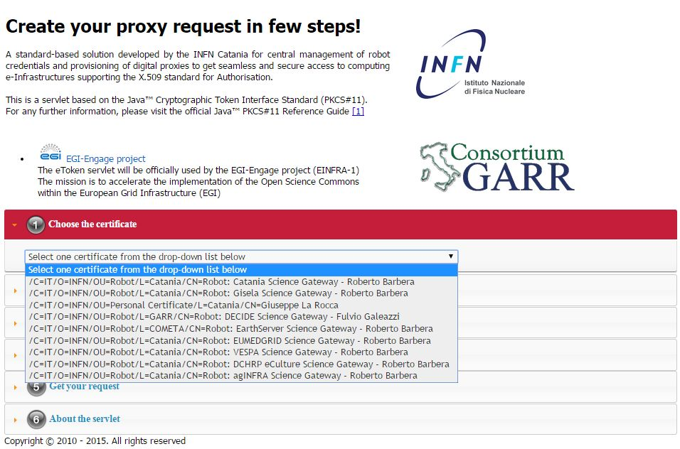

The creation of a request to access the generic USB smat card and generates a proxy certificate is performed in few steps.

- First and foremost we have to select a valid digital certificate from the list of available certificates (first accordion). 

- Afterwards, depending by the selected certificate, it will be possible to select a list of FQANs attributes which will be taken into account during the proxy creation process.

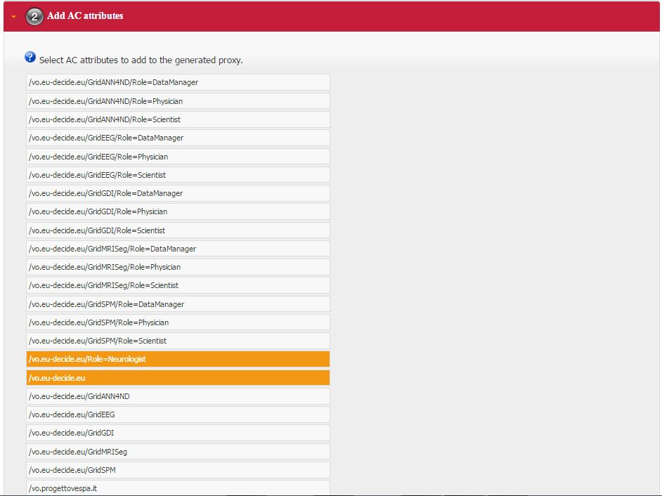

- If necessary FQANs order can be changed in step 3:

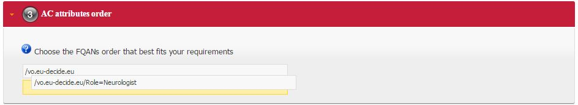

- Before to complete, some additional options can be specified in the 4th. step to customize the proxy requestID:

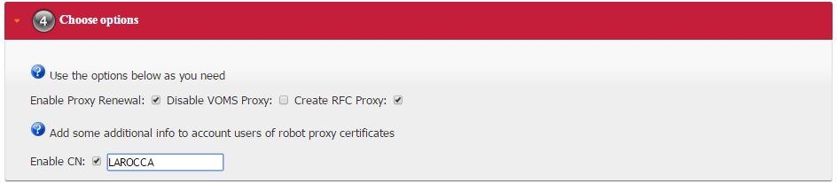

- At the end, the complete requestID is available in step 5:

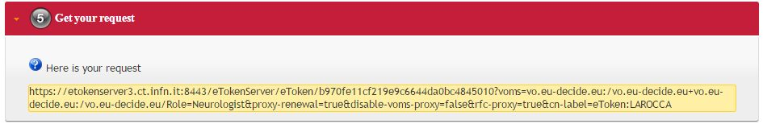

============
Chapter VI - Some RESTful APIs
============
REST is an architectural style which defines a set of constraints that, when applied to the architecture of a distributed system, induces desiderable properties like lookse coupling and horizontal scalability.
RESTful web services are the result of applying these constraints to services that utilize web standards such as URIs, HTTP, XML, and JSON. Such services become part of the fabric of the web and can take advantage of years of web engineering to satisfy their clients' needs. The Java API for RESTful web services (JAX-RS) is a new API that aims to make development of RESTful web services in Java simple and intuitive.

In this chapter will be presented some examples of RESTful APIs used to request proxies certificates, list available robot certificates in the server-side and register long-term proxies on the MyProxy server.

Create RFC 3820 complaint proxy (simple use case):
-----------------

.. code:: bash

 https://<etoken_server>:8443/eTokenServer/eToken/332576f78a4fe70a52048043e90cd11f?\
         voms=fedcloud.egi.eu:/fedcloud.egi.eu&\
         proxy-renewal=true&\
         disable-voms-proxy=false&\
         rfc-proxy=true&cn-label=Empty

Create RFC 3820 complaint proxy (with some additional info to account real users):
-----------------

.. code:: bash

 https://<etoken_server>:8443/eTokenServer/eToken/332576f78a4fe70a52048043e90cd11f?\
         voms=fedcloud.egi.eu:/fedcloud.egi.eu&\
         proxy-renewal=true&\
         disable-voms-proxy=false&\
         rfc-proxy=true&\
         cn-label=LAROCCA

Create full-legacy Globus proxy (old fashioned proxy):
-----------------

.. code:: bash

 https://<etoken_server>:8443/eTokenServer/eToken/43ddf806454eb55ea32f729c33cc1f07?\
         voms=eumed:/eumed&\
         proxy-renewal=true&\
         disable-voms-proxy=false&\
         rfc-proxy=false&\
         cn-label=Empty

Create full-legacy proxy (with more FQANs):
-----------------

.. code:: bash

 https://<etoken_server>:8443/eTokenServer/eToken/b970fe11cf219e9c6644da0bc4845010?\
         voms=vo.eu-decide.eu:/vo.eu-decide.eu/Role=Neurologist+vo.eu-decide.eu:/vo.eu-decide.eu&\
         proxy-renewal=true&\
         disable-voms-proxy=false&\
         rfc-proxy=false&\
         cn-label=Empty

Create plain proxy (without VOMS ACs):
-----------------

.. code:: bash

 https://<etoken_server>:8443/eTokenServer/eToken/332576f78a4fe70a52048043e90cd11f?\
         voms=gridit:/gridit&\
         proxy-renewal=true&\
         disable-voms-proxy=true&\
         rfc-proxy=false&\
         cn-label=Empty

Get the list of avilable robot certificates in the server (in JSON format):
-----------------

.. code:: bash

 https://<etoken_server>:8443/eTokenServer/eToken?format=json

Get the MyProxy settings used by the eToken server (in JSON format):
-----------------

.. code:: bash

 https://<etoken_server>:8443/MyProxyServer/proxy?format=json

Register long-term proxy on the MyProxy server (only for expert user):
-----------------

.. code:: bash

 https://<etoken_server>:8443/MyProxyServer/proxy/x509up_6380887419908824.long

============
Appendix I - Administration of the eToken smart cards
============
This appendix provides a brief explaination of the eToken Properties (*etProps*) and the various configuration options available to the user.

*eToken Properties* provides users with a configuration tool to perform basic token management such as password changes, viewing information, and viewing of certificates on the eToken.

This appendix includes the following sections:

* Initializing the eToken PRO 32/64 KBytes USB smart card;

* Importing new certificates;

* Renaming a token.

The *eToken Properties* application displays all the available tokens connected to the server as show in the below figure:

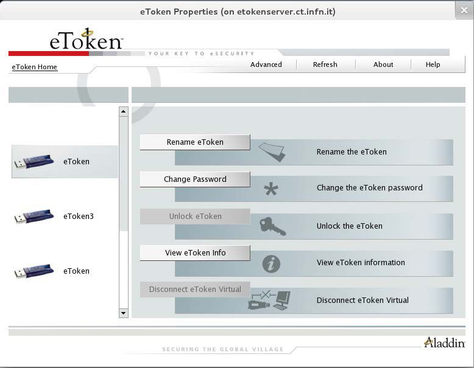

In the right pane, the user may select any of the following actions which are enabled:

1.) **Rename eToken** - set a label for the given token;

2.) **Change Password** - changes the eToken user password;

3.) **Unlock eToken** - resets the user password via a challenge response mechanism (pnly enabled when an administrator password has been initialized on the eToken);

4.) **View eToken Info** - provides detailed information about the eToken;

5.) **Disconnect eToken Virtual** - disconnects the eToken Virtual with an option for deleting it.

The toolbar along the top contains these functions:

1.) **Advanced** - switches to the Advanced view;

2.) **Refresh** - refreshes the data for all connected tokens;

3.) **About** - displayes information about the product version;

4.) **Help** - launches the online help.

- **Renaming the eToken**
The token name may be personalized. To rename a token:

1.) In the left pane of the *eToken Properties* window, select the token to be renamed.

2.) Click **Rename eToken** in the right pane, and the Rename eToken dialog box is displayed as shown in the below figure:

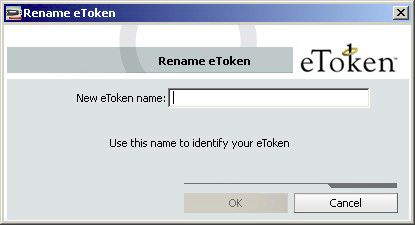

3.) **Enter** the new name in the New eToken name field.

4.) Click **OK**. The new token name is displayed in the *eToken Properties* window.

- **Initializing the eToken**
The eToken initialization option restores an eToken to irs initial state. It removes all objects stored on the eToken since manufacture, frees up memory, and resets the eToken password, allowing administrators to initialize the eToken according to specific organizational requirements or security modes.

The following data is initialized:

* eToken name;

* User password;

* Administrator password;

* Maximum number of login failures (for user and administrator passwords);

* Requirement to change the password on the first login;

* Initialization key.

To initialize the eToken:

1.) Click on **Advanced** from the toolbar to switch to the Advanced view.

2.) **Select** the eToken you want to initialize.

3.) Click **Initialize eToken** on the toolbar, or right-click the token name in the left pane and select Initialize eToken from the shortcut menu. The eToken Initialization Parameters dialog box opens.

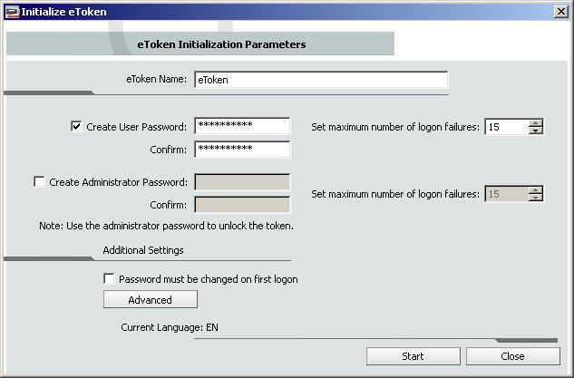

4.) Enter a name for the eToken in the eToken Name field. If no name is entered, the default name, "eToken", is applied.

5.) Select **Create User Password** to initialize the token with an eToken user password. Otherwise, the token is initialized without an eToken password, and it will not be usable for eToken applications.

6.) If **Create User Password** is selected, enter a new eToken user password in the Create User Password and Confirm fields.

7.) I nthe Set maximum number of logon failures fields, enter a vaule between 1 and 15. This counter specifies the number of times the user or administrator can attempt to log on to the eToken with an incorrect password before the eToken is locked. The default setting for the maximum number of incorrect logon attempts is 15.

8.) To configure advanced settings, click **Advanced**. The eToken Advanced Settings dialog box opens.

9.) **Check Load 2048-bit RSA key support**

|warning| All eTokens are configured with the following default password **1234567890**.

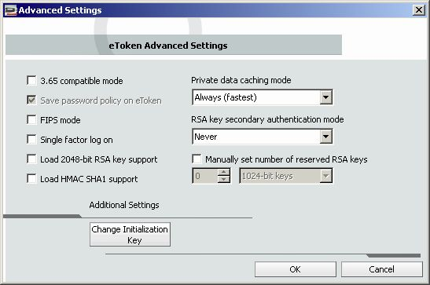

- **To import a certificate**

1.) Click on **Advanced** from the toolbar to switch to thre Advanced view.

2.) **Select** the eToken where you want to upload a new certificate.

3.) Click **Import Certificate** on the toolbar, or right-click the token name in the left pane and select **Import Certificate** from the shortcut menu. The Import Certificate dialog box opens.

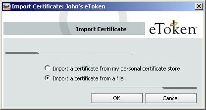

4.) Select whether the certificate to import is on your personal computer store on the computer, or on a file. 
If you select the personal certificate store, a list of available certificates is displayed. Only certificates that can be imported on to the eToken are listed. These are:

- Certificates with a private key already on the eToken;

- Certificates that may be imported from the computer together with its private key.

5.) If you select Import a certificate from a file, the Choose a certificate dialog box opens.

6.) Select the certificate to import and click **Open**.

7.) If the certificate requires a password, a Password dialog box opens.

8.) Enter the certificate password. A dialog box opens asking if you want to store the CA certificate on the eToken.

9.) Select **No**. The only certificate is imported and a confirmation message is shown.

============
Appendix II - Increase "Open Files Limit"
============

|alert| If you are getting the error *"Too many open files (24)"* then your application is hitting max open file limit allowed by Linux.

Check limits of the running process:

* Find the process-ID (PID):

.. code:: bash

        ]# ps aux | grep -i process-name

* Suppose XXX is the PID, then run the command to check limits:

.. code:: bash

        ]# cat /proc/XXX/limits

To increase the limit you have to:

(i) Append the following settings to set the user-limit

.. code:: bash

        ]# cat /etc/security/limits.conf

        *          hard    nofile  50000
        *          soft    nofile  50000
        root       hard    nofile  50000
        root       soft    nofile  50000

Once you have saved the file, you have to logout and login again.

(ii) Set the higher than user-limit set above. 

.. code:: bash

        ]# cat /etc/sysctl.conf

        fs.file-max = 2097152

Run the command

.. code:: bash

        ]# sysctl -p

(iii) Verify the new limits. Use the following command to see max limit of the file descriptors:

.. code:: bash

        ]# cat /proc/sys/fs/file-max

============
Appendix III - Configure GlassFish settings
============

To set JVM settings, please add the following GLASSFISH_OPTS settings in *catalian.sh*

.. code:: bash

   CATALINA_OPTS="$CATALINA_OPTS -Xmx2336m -Xms2336m \
                  -XX:NewSize=467215m -XX:MaxNewSize=467215m \
                  -XX:PermSize=467215m -XX:MaxPerSize=467215m \
                  -server"

============
Troubleshooting
============

* Private key in PKCS#8

  *Cannot load end entity credentials from certificate file: /etc/grid-security/hostcert.pem and key file: /etc/grid-security/hostkey.pem*

.. code:: bash

        ]# cd /etc/grid-security/
        ]# mv hostkey.pem hostkey-pk8.pem
        ]# openssl rsa -in hostkey-pk8.pem -out hostkey.pem
        ]# chmod 400 hostkey.pem

        ]# cd <apache-tomcat>
        ]# ./bin/catalina.sh stop
        ]# ./bin/catalina.sh start

.. _27: https://lists.desy.de/sympa/arc/user-forum/2011-11/msg00052.html

For further information, please read the document [27_]

============
Log Files
============

* The log messages for the eTokenServer are stored in *<apache-tomcat>/logs/eToken.out*

* The log messages for the MyProxyServer are stored in *<apache-tomcat>/logs/MyProxy.out*

* In case of errors and debug, please check these additional log files:

.. code:: bash

        ]# <apache-tomcat>/logs/catalina.out
        ]# <apache-tomcat>/logs/localhost.<date>.log

============
Contributor(s)
============
Please feel free to contact us any time if you have any questions or comments.

.. _INFN: http://www.ct.infn.it/

:Authors:

 Roberto BARBERA - Italian National Institute of Nuclear Physics (INFN_),

 Giuseppe LA ROCCA - Italian National Institute of Nuclear Physics (INFN_),

 Salvatore MONFORTE - Italian National Institute of Nuclear Physics (INFN_)

