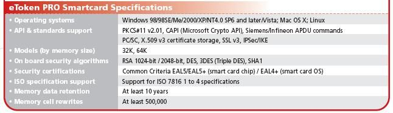

****************************************************************************
How-to install and configure the eToken & the MyProxy servlets (v2.0.4) Docs
****************************************************************************

===================
About this document
===================

.. _1: http://www.safenet-inc.it/etoken-pro.html
.. _2: http://www.catania-science-gateways.it/
.. _3: http://www.safenet-inc.it/

This is the official documentation to configure and install the eTokenServer servlet (v2.0.4).

This document provides an in-depth overview of the light-weight crypto library, a standard-based solution developed by INFN Catania for central management of robot credentials and provisioning of digital proxies to get seamless and secure access to computing e-Infrastructures supporting the X.509 standard for Authorisation.

In this solution robot certificates are available 24h per day on board of USB eToken PRO [1_] 32/64 KBytes smart cards having the following technical specification:

We appreciate attribution. In case you would like to cite the Java light-weight crypto library in your papers, we recomment that you use the following reference:

        V. Ardizzone, R. Barbera, A. Calanducci, M. Fargetta, E. Ingra', I. Porro, 
        G. La Rocca, S. Monforte, R. Ricceri, R. Rotondo, D. Scardaci and A. Schenone
        ***The DECIDE Science Gateway***
        *Journal of Grid Computing (2012) 10:689-70 DOI 10.1007/s10723-012-9242-3*

We also would like to be notified about your publications that involve the use of the Java light-weight crypto libraries, as this will help us to document its usefulness. We like to feature links to these articles, with your permission, on our Web site.
Additional reference to the Java light-weight crypto library and other relevant activities can be fould at [2_].

============
Licence
============
Licensed to the Apache Software Foundation (ASF) under one or more contributor license agreements.  See the NOTICE file distributed with this work for additional information regarding copyright ownership.
The ASF licenses this file to You under the Apache License, Version 2.0 (the "License"); you may not use this file except in compliance with the License.  You may obtain a copy of the License at http://www.apache.org/licenses/LICENSE-2.0

Unless required by applicable law or agreed to in writing, software distributed under the License is distributed on an "AS IS" BASIS, WITHOUT WARRANTIES OR CONDITIONS OF ANY KIND, either express or implied.
See the License for the specific language governing permissions and limitations under the License.

============
Conventions used in this document
============
The following typographical conventions are used in this document:

*Italic*
        Indicates new terms, URLs, filenames, and file extentions

**Constant width italic**
        Shows text that should be replaced with user-specific values

.. image:: images/warning.jpg
      :align: left

This icon indicates a warning or caution.

.. image:: images/download.jpg
      :align: left

This icon indicates that there are files to be downloaded.

============
Chapter I - Overview of the light-weight crypto library
============
The "light-weight" crypto library interface has been designed to:

- provide seamless and secure access to computing e-Infrastructure based on middleware supporting X.509 standard for authorization, using robot certificates,

- make user's interaction with security infrastructures easy and transparent.

The high-level architecture of the library interface is shown in the below figure:

The business logic has been conceived to provide "resources" (e.g. complaint VOMS proxies) in a "web-manner" which can be consumed by authorized users, client applications and by portals and Science Gateways. In the current implementation, robot certificates have been safely installed on board of SafeNet [3_] eToken PRO [1_] 32/64 KBytes USB smart cards directly plugged to a remote server which serve, so far, six different Science Gateways.

.. _4: http://tomcat.apache.org/
.. _5: https://jax-rs-spec.java.net/
.. _6: http://www.oracle.com/technetwork/articles/javaee/index-jsp-136246.html
.. _7: http://docs.oracle.com/javase/7/docs/technotes/guides/security/p11guide.html
.. _8: https://www.bouncycastle.org/
.. _9: https://github.com/jglobus/JGlobus
.. _10: https://github.com/italiangrid/voms-clients
.. _11: https://github.com/italiangrid/voms-admin-server/tree/master/voms-admin-api

The complete list of software, tools and APIs we have used to implement the new crypto library interface are listed below:

- Apache Application Server [4_],

- JAX-RS, the Java API for RESTful Web Services (JSR 311 standard) [5_], 

- Java Technology Standard Edition (Java SE6) [6_],

- The Cryptographic Token Interface Standard (PKCS#11) libraries [7_],

- The open-source BouncyCastle Java APIs [8_],

- The JGlobus-Core Java APIs [9_],

- The VOMS-clients Java APIs [10_],

- The VOMS-Admin Java APIs [11_].

============
Chapter II - System and Software Requirements
============
This chapter provide the list of requirements and the basic information that you need to know to install and configure the servlet.

+---+-----------------------+-------------------------+--------------+------------+--------------+
| # |        Server         |   OS and Architecture   |  Host. Cert  | Disk Space | CPU and RAM  |
+===+=======================+=========================+==============+============+==============+
| 1 | Physical machine with | SL release 5.10 (Boron) |     Yes      |  >= 80 GB  |  >= 4 cores  |
|   | at least 2 USB ports  | x86_64 GNU/Linux        |              |            |  >= 8 GB RAM |
|   | perfectly working     |                         |              |            |  Swap >=4 GB |
+---+-----------------------+------------+------------+--------------+------------+--------------+
| Comments:                                                                                      |
|                                                                                                |
| - The server must be registered to the DNS with direct adn reverse resolution;                 |
|                                                                                                |
| - Please set a **human readable** server hostname for your server (e.g. etoken<your-domain>);  |
|                                                                                                |
| - The OS installation should include the X-server since it is needed to open etProps app;      |
|                                                                                                |
| - This installation has been successfully tested with eToken PRO 32/64 KBytes USB smart cards; |
|                                                                                                |
| - At least 1 USB eToken PRO 75 KBytes must be available before the installation                |
|   (contact SafeNet Inc. [3_] to find a neighbor reseller and get prices).                      |
+------------------------------------------------------------------------------------------------+

===================
OS and repos
===================
Start with a fresh installation of Scientific Linux 5.x (x86_64).

.. code:: bash

  ]# cd /etc/redhat-release
  Scientific Linux release 5.10 (Boron)

- Configure the EGI Trust Anchor repository

.. code:: bash

  ]# cd /etc/yum.repos.d/
  ]# cat egi-trustanchors.repo
  [EGI-trustanchors]
  name=EGI-trustanchors
  baseurl=http://repository.egi.eu/sw/production/cas/1/current/
  gpgkey=http://repository.egi.eu/sw/production/cas/1/GPG-KEY-EUGridPMA-RPM-3
  gpgcheck=1
  enabled=1

- Install the latest EUGridPMA CA rpms

.. code:: bash

  ]# yum clean all
  ]# yum install -y ca-policy-egi-core

- Configure the EPEL repository:

.. code:: bash

  ]# cd /etc/yum.repos.d/
  ]# cat /etc/yum.repos.d/epel.repo 
  [epel]
  name=Extra Packages for Enterprise Linux 5 - $basearch
  #baseurl=http://download.fedoraproject.org/pub/epel/5/$basearch
  mirrorlist=http://mirrors.fedoraproject.org/mirrorlist?repo=epel-5&arch=$basearch
  failovermethod=priority
  enabled=1
  gpgcheck=1
  gpgkey=file:///etc/pki/rpm-gpg/RPM-GPG-KEY-EPEL

  [epel-debuginfo]
  name=Extra Packages for Enterprise Linux 5 - $basearch - Debug
  #baseurl=http://download.fedoraproject.org/pub/epel/5/$basearch/debug
  mirrorlist=http://mirrors.fedoraproject.org/mirrorlist?repo=epel-debug-5&arch=$basearch
  failovermethod=priority
  enabled=0
  gpgkey=file:///etc/pki/rpm-gpg/RPM-GPG-KEY-EPEL
  gpgcheck=1

  [epel-source]
  name=Extra Packages for Enterprise Linux 5 - $basearch - Source
  #baseurl=http://download.fedoraproject.org/pub/epel/5/SRPMS
  mirrorlist=http://mirrors.fedoraproject.org/mirrorlist?repo=epel-source-5&arch=$basearch
  failovermethod=priority
  enabled=0
  gpgkey=file:///etc/pki/rpm-gpg/RPM-GPG-KEY-EPEL
  gpgcheck=1

- Install the latest epel release

.. code:: bash

  ]# yum install -y epel-release-5.4.noarch

===================
SELinux configuration
===================

.. _12: fedoraproject.org/wiki/SELinux/setenforce

Be sure that SELinux is disabled (or permissive). Details on how to disable SELinux are here [12_]

.. code:: bash

   ]# getenforce
   Disabled

===================
sendmail
===================

Start the sendmail service at boot. 
Configure access rules to allow connections and open the firewall on port 25.

.. code:: bash

   ]# /etc/init.d/sendmail start
   ]# chkconfig --level 2345 sendmail on

   ]# cat /etc/hosts.allow
   sendmail: localhost

   ]# cat /etc/sysconfig/iptables
   [..]
   -A RH-Firewall-1-INPUT -p tcp -m tcp --dport 25 -s 127.0.0.1 -j ACCEPT

===================
Host Certificates
===================

.. _12: http://www.eugridpma.org/members/worldmap/
.. _13: https://comodosslstore.com/

Navigate the interactive map and search for your closest Certification Authorities [12_] or, alternatively, buy a multi-domain COMODO [13_] SSL certificate.

Public and Private keys of the host certificate have to be copied in /etc/grid-security/

.. code:: bash

   ]# ll /etc/grid-security/host*
   -rw-r--r--  1 root root 1627 Mar 10 14:55 /etc/grid-security/hostcert.pem
   -rw-------  1 root root 1680 Mar 10 14:55 /etc/grid-security/hostkey.pem

===================
Configuring VOMS Trust Anchors
===================
The VOMS-clients APIs need local configuration to validate the signature on Attribute Certificates issued by trusted VOMS servers.

The VOMS clients and APIs look for trust information in the */etc/grid-security/vomsdir* directory.

The *vomsdir* directory contains a directory for each trusted VO. Inside each VO two types of files can be found:

- An *LSC*  file contains a description of the certificate chain of the certificate used by a VOMS server to sign VOMS attributes.

- An *X509* certificates used by the VOMS server to sign attributes.

These files are commonly named using the following pattern:

.. code:: bash

   <hostname.lsc>
   <hostname.pem>

where *hostname* is the host where the VOMS server is running.

When both *.lsc* and *.pem* files are present for a given VO, the *.lsc* file takes precedence. 
The *.lsc* file contains a list of X.509 subject strings, one on each line, encoded in OpenSSL slash-separate syntax, describing the certificate chain (up and including the CA that issued the certificate). For instance, the *voms.cnaf.infn.it* VOMS server has the following *.lsc* file:

.. code:: bash
  
  /C=IT/O=INFN/OU=Host/L=CNAF/CN=voms.cnaf.infn.it
  /C=IT/O=INFN/CN=INFN CA

.. image:: images/warning.jpg
         :align: left
Install in the */etc/grid-security/vomsdir/* directory the *.lsc* and X.509 certificate for each trued VO you want to support.

+---+------------------------------+---------------+
|                                  |               |
+==================================+===============+
| .. image::// images/warning.jpg  |  cc           |
+----------------------------------+---------------+

============
Support
============
Please feel free to contact us any time if you have any questions or comments.

.. _INFN: http://www.ct.infn.it/

:Authors:

 `Roberto BARBERA <mailto:roberto.barbera@ct.infn.it>`_ - Italian National Institute of Nuclear Physics (INFN_),

 `Giuseppe LA ROCCA <mailto:giuseppe.larocca@ct.infn.it>`_ - Italian National Institute of Nuclear Physics (INFN_),

 `Salvatore MONFORTE <mailto:salvatore.monforte@ct.infn.it>`_ - Italian National Institute of Nuclear Physics (INFN_)

:Version: v2.0.4, 2015

:Date: June 4th, 2015 17:50
